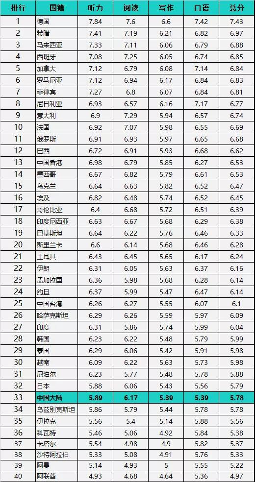
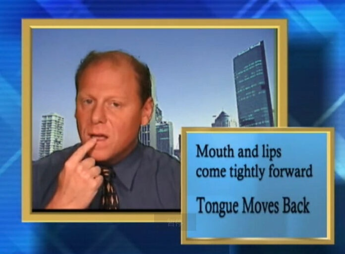
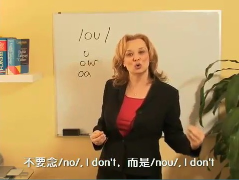
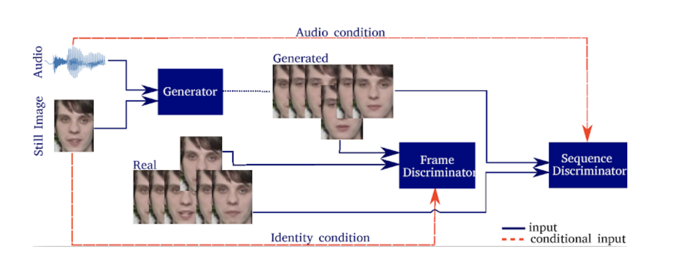
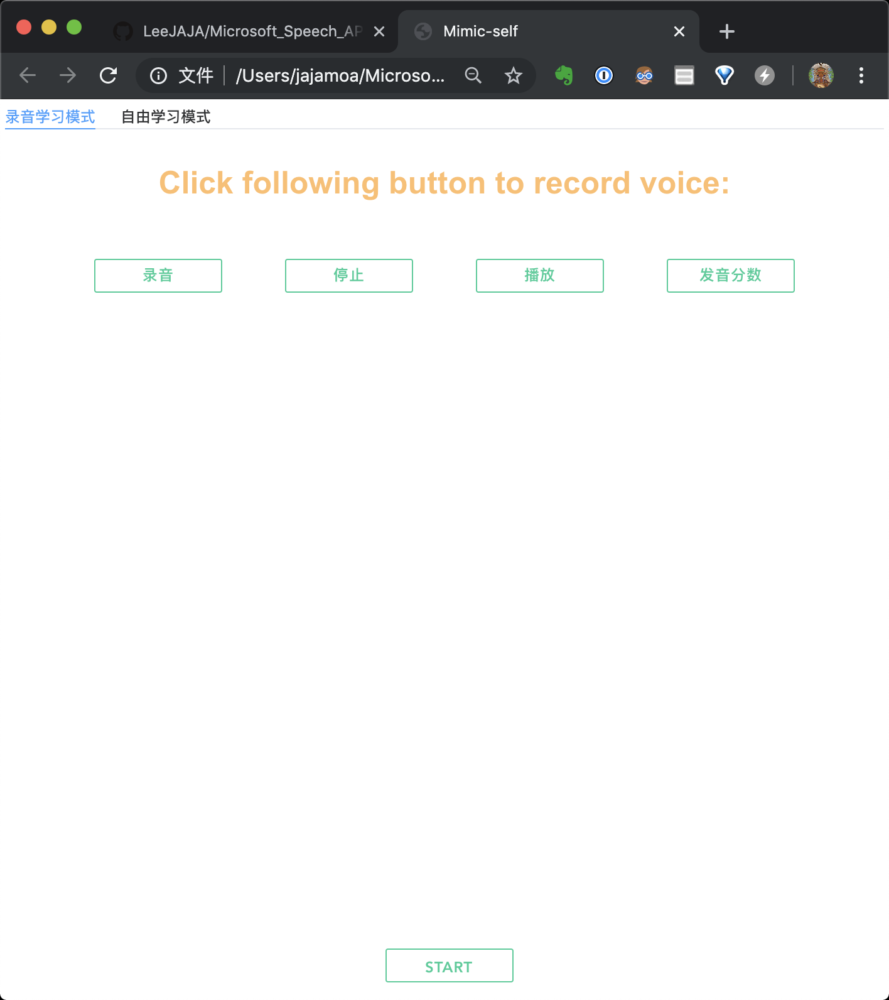
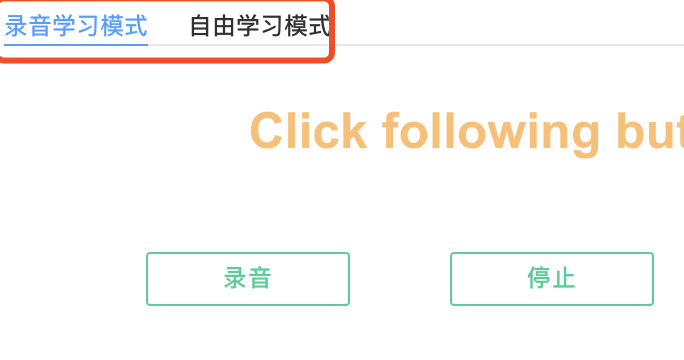

# MimicSelf-基于STT、TTS、SDA的口型视频模仿发音矫正助手

## MimicSelf 项目说明文档

 * [MimicSelf 项目说明文档](#mimicself-项目说明文档)
    * [01 项目介绍](#01-项目介绍)
       * [1.1 成员介绍](#11-成员介绍)
       * [1.2 项目背景](#12-项目背景)
       * [1.3 当前痛点](#13-当前痛点)
    * [02 竞品分析](#02-竞品分析)
       * [2.1 战略定位](#21-战略定位)
       * [2.2 产品功能](#22-产品功能)
       * [2.3 差异化分析](#23-差异化分析)
          * [2.3.1 英语流利说](#231-英语流利说)
          * [2.3.2 视频教学](#232-视频教学)
    * [03 创新性解决方案](#03-创新性解决方案)
       * [3.1 技术思路](#31-技术思路)
       * [3.2 技术路线](#32-技术路线)
          * [3.2.1 Microsoft Azure Speech「语音到文本」STT](#321-microsoft-azure-speech语音到文本stt)
          * [3.2.2 Microsoft Azure Speech「文本到语音」TTS](#322-microsoft-azure-speech文本到语音tts)
          * [3.2.3 Speech-Driven Animation (<a href="https://sites.google.com/view/facialsynthesis/home" rel="nofollow">https://sites.google.com/view/facialsynthesis/home</a>)](#323-speech-driven-animation-httpssitesgooglecomviewfacialsynthesishome)
    * [04 成果说明](#04-成果说明)
       * [4.1 功能介绍](#41-功能介绍)
          * [模式一 录音学习模式](#模式一-录音学习模式)
             * [功能一：口型比对](#功能一口型比对)
             * [功能二：Mimic Yourself](#功能二mimic-yourself)
             * [功能三：评分系统](#功能三评分系统)
          * [模式二 自由学习模式](#模式二-自由学习模式)
       * [4.2 操作介绍](#42-操作介绍)
          * [4.2.1 UI通览](#421-ui通览)
          * [4.2.2 录音学习模式](#422-录音学习模式)
          * [4.2.3 自由学习模式](#423-自由学习模式)
    * [05 Demo 使用说明](#05-demo-使用说明)
    * [06 使用语音 API 过程中的问题](#06-使用语音-api-过程中的问题)
    * [07 未来的进一步完善](#07-未来的进一步完善)

### 01 项目介绍

`MimicSelf-基于STT、TTS、SDA的口型视频模仿发音矫正助手`是一款能够帮助使用者通过调整口型来矫正发音的小工具，在使用过程中，使用者可以使用两种不同的学习模式，利用程序所生成的口型视频来改善自身发音。

#### 1.1 成员介绍

* **李嘉杰**

  2018-2019学年国家奖学金获得者 

  获得过以下奖项:

  2019中美青年创客大赛（上海赛区）冠军
  
  2019中美青年创客大赛总决赛 优胜奖
  
  2019同济大学数学建模竞赛 一等奖
  
  “纽劢杯”第十六届同济大学程序设计竞赛 二等奖 
  
  负责工作：算法部分、后端代码部分、产品设计、文档编写
  
* **李培昊**

  负责工作：部分前端

* **刘雪迪**

  负责工作：前端CSS部分

* **孙文麒**

  2018-2019学年国家奖学金获得者 

  目前也正在进行校级创新创业项目的APP开发。

  获得过“纽劢杯”第十六届同济大学程序设计竞赛暨上海高校邀请赛 二等奖 

  负责工作：文档部分

* **王泽钜**

  喜欢编程，热爱生活，乐于学习新鲜事物，喜欢和不同的人打交道，擅长团队合作和语言表达，享受创造的过程。 获得过以下奖项：

  同济大学大学生程序设计竞赛 二等奖

  中美青年创客大赛全国总决赛 优胜奖

  同济大学数学建模竞赛 三等奖

  众安hackathon，成功入围AI赛道复赛 

  负责工作：网站后端（非算法部分）、网站前端、项目设计

#### 1.2 项目背景

在雅思官方发布的“2019年全球雅思A类平均成绩TOP40排名”中，德国以总成绩7.43分的高分蝉联第一，希腊以总成绩6.97持续稳居第二。中国大陆以5.78分的总成绩排名第33位，同比2017年上升1位。亚洲国家中，英语为主流语言的马来西亚、菲律宾进入前十。此外，泰国、印度、越南、韩国、日本亚洲国家排名均优于中国大陆。

良好的发音对于语言的学习有着不可估量的作用.准确的发音不仅能够增强对语言信息的提取，提高学习者的听力能力，也能在学习过程中，使学习者更容易记忆单词、句式，培养语感等等。中国人在英语学习中投入了大量的时间精力，但收效却不甚理想，这是传统的口语学习方式的不科学导致的。我们在英语口语的教学过程中极大地低估了“口型”的重要性，我们有着大量的英语听力素材摄入量，但在“口型”学习上却严重不足。

在学习说一门语言的过程中，发音练习非常重要，而学好发音仅靠听觉输入是不足的。以英语为例，在发音训练上，看视频教程比跟读音频要好，因为视频教程往往更直观，更有利于掌握发音要点，比如/θ/的发音，连读等。

事实上，发音不准很大的原因是嘴型和舌头不到位，/f/和/v/音不摩擦下嘴唇，/r/音舌头不卷得不充分等。这时就需要大量的模仿纯正美语发音的口型，看发音视频课。 

比如由Paul S Gruber保罗.格罗博士录制的美式英语发音视频教程。 

 再如美国斯坦福大学语言学教授，加州大学圣地亚哥语言研究中心首席科学家Lisa博士的发音教程，将教你怎样使用舌头、嘴唇、牙齿，发出地道的美语口语发音。 

  

但是这样的视频教程仍然存在着进一步改善教学质量的空间。

#### 1.3 当前痛点

1. **教学素材单一**
   *视频形式的教学材料需要录制后发布，因此所有发音素材皆为固定素材。这意味着当学习者希望了解某一个特定单词或长句的标准发音以及对应的标准口型时，此类视频资料将无能为力。*

2. **教学缺乏个性化**
   *不同人种间，不同个体间肌肉成分、骨骼结构差距极大，不同的人在发出同一个标准音时的口型不可能完全一样，学习者如果盲目地模仿单一教学者的口型势必会影响学习效果。*
3. **学习形式不灵活**
   *此类学习视频被制作成固定形式。每一次的发音学习与训练都必须从某一个视频的开头开始，而之前看过或已经掌握的发音练习部分将变为额外信息，成为学习者不必要时时间成本。相比之下，理想的学习模式应是让学习者可以将精力集中用于需要学习的几个音、词、句上进行练习。*

而问题是，在发音矫正这方面，并没有APP给出了解决方案，目前意义上的APP都只是锻炼口语交际，并没有革新性的手段来帮助改正发音，大多数情况下，用户都只能采取观看视频学习口型这一手段。这种方法的效率并没有想象中的那么高，大多数情况下都无法奏效。

因此，我们团队决定从通过 **视频口型教学纠正发音** 这一方面出发，基于**传统发音教学** 以及 **传统视频口型教学**，提出新的方案，进一步提高效率。换言之，本项目想要解决的问题是 **“如何利用新技术，让口型发音矫正更高效”** 这一问题。

#### 

### 02 竞品分析

#### 2.1 战略定位

| 竞品       | 产品定位    | 收益流            | 用户定位         | 主要功能                 |
| ---------- | ----------- | ----------------- | ---------------- | :----------------------- |
| 英语流利说 | 口语练习APP | 收费课程/"定制学" | 学生,白领为主    | 材料配音式练习;智能打分  |
| 扇贝口语   | 口语练习APP | 收费课程          | 高校学生群体为主 | 跟读;复述式学习;智能打分 |
| 口语视频   | 视频教学    | 打赏              | 几乎全覆盖       | 教学                     |

#### 2.2 产品功能

| 竞品       | 基本功能                                                     | 亮点功能                                   |
| ---------- | ------------------------------------------------------------ | ------------------------------------------ |
| 英语流利说 | 1. 英语水平测试 2. 自动提醒 3. 课程订阅 4. 发音准确度评分 5. 配音材料 | 1. 发音准确度评分 2. 课程内容丰富     |
| 扇贝口语   | 1. 自动提醒 2. 课程订阅 3. 配音材料 4. 发音准确度评分 5. 联立其他扇贝功能 | 1. 发音准确度评分 2. 联立其他扇贝功能 |
| 口语视频   | 1. 发音教学 2. 多样化形式教学                           | 1. 形式多样化,吸引力强.                    |

#### 2.3 差异化分析

由于英语流利说和扇贝口语较为接近，此处以英语流利说为代表。

##### 2.3.1 英语流利说

通过将一些日常用语，影视对话，歌曲等作为朗读材料，提高用户口语.着重提高用户的整体口语能力，并且也提高用户的日常交际能力. 可以看出，英语流利说和扇贝口语两者的定位都是"口语练习"。两款APP都是以告诉用户哪里读的有问题，而不太涉及教学部分。

##### 2.3.2 视频教学

采取口型发音教学的手段，让用户去模仿视频中的标准发音，从而达到教学的作用。主要定位为发音矫正教学，但就如先前阐述项目背景中所提到的，事实上用户直接通过视频矫正发音的效率并不高，因此反馈（评论）也大多数较为中立。

### 03 创新性解决方案

#### 3.1 技术思路

1. 定制个性化的口型发音视频
2. AI场景下的趣味练习

在此基础上，用户也可以拍摄一段自己的口型，与生成的正确口型视频作对照，来更好地了解到自己口型的问题。

#### 3.2 技术路线

##### 3.2.1 Microsoft Azure Speech「语音到文本」STT

STT 即语音服务中的语音转文本功能，能快速地将各种来源的音频转换为文本。使用自定义模型来克服常见的语音识别障碍，例如独特的词汇、说话风格或背景噪音。通过帮助所有人实时跟踪和参与对话，使音频内容更便于获取。TTS 由深度神经网络模型提供的领先的语音识别准确性，将音频实时听录为文本，以便对话中的所有参与者都能充分参与。同时还能根据说话风格和特定领域的术语量身定制语音识别，在任何地方都能灵活地大显身手。

##### 3.2.2 Microsoft Azure Speech「文本到语音」TTS

「文本到语音」转换取得的进展是微软团队在过去两年中取得的突破之一，它使用深度神经网络合成声音来克服传统「文本到语音」系统在匹配口语的重读和语调（称为韵律结构），以及将语音单元合成为计算机音频方面的局限性。TTS 合成的声音拥有与人类类似的神经韵律和吐字发音，达到了几乎无法分辨的地步。神经 TTS 可以在人类与 AI 系统交互时大大减轻听觉疲劳，让人与机器人或虚拟助手的互动更加自然、有吸引力。

##### 3.2.3 Speech-Driven Animation (https://sites.google.com/view/facialsynthesis/home)

这是一种 **temporal GAN**，该 **temporal GAN** 可以仅使用人的静止图像和包含语音的音频剪辑来生成动画面孔。 我们的方法直接从原始音频转换为视频，而无需其他后处理步骤。 我们的网络使用两种类型的 Discriminator：

*Frame Discriminator：Frame Discriminator 评估取自 **合成/真实** 序列的单个帧。 这将驱动生成器生成详细的帧。
Sequence Discriminator：Sequence Discriminator评估序列音频对，以确定它们是真实的还是合成的。 这样可以使音频和视频保持同步，并鼓励生成面部表情（例如眨眼）*

总的来说，我们将用户输入的 ***原始语音***，通过「语音到文本」获得内容，再通过「文本到语音」获得标准的语音，最后通过 **Speech-Driven Animation**（后简称SDA）获得对应的 ***标准口型视频***。

### 04 成果说明

#### 4.1 功能介绍

##### 模式一 录音学习模式

在这一学习模式下，我们从 **三个创新维度** 优化了 **用户通过口型视频** 进行发音学习的问题。

###### 功能一：口型比对

用户可以通过自己 **朗读** 单词/短句，来得到两段由程序（*SDA*）生成的  **视频**。第一段为**直接根据用户发音而得出的原始口型**，另一段为使用 Microsoft Azure 中 Speech API 的 *语音转文字*  与 *文字转语音*，最后通过 程序（*SDA*）生成 的 **标准口型视频**。用户在使用过程中，可以直接对比两个视频的异同，来获知自己的发音究竟在口型上与母语使用者有哪些的不同。

通过 Microsoft Azure 中 Speech API 的 **神经语音服务** 生成的语音已经几乎达到了难以分辨真假的高仿真，以此生成的SDA视频的仿真度也媲美了真人录制的发音教学视频。

###### 功能二：Mimic Yourself

这一部分功能也是本项目的创新功能之一。不同人种间，不同个体间肌肉成分、骨骼结构差距极大，不同的人在发出同一个标准音时的口型不可能完全一样，学习者如果盲目地模仿单一教学者的口型势必会影响学习效果。

录音学习模式下在默认状态下会使用一欧美男性作为口型生成来源， 但用户可选择性上传 **自己脸部照片** 生成自己的口型视频（可参考demo）。

举个例子，假如我是 **黄晓明**， 我可以上传自己帅气的照片，然后通过本系统学习英语的正确发音，对比自己的原始口型（闹太套）和标准口型（not at all）的区别。

###### 功能三：评分系统

加入了评分系统，对于用户发出的语音可以进行评分。具体实现为使用户直接发出的 **原始语音** 与使用 Microsoft Azure 中 Speech API 的 *语音转文字*  识别用户语音再经过 *文字转语音* 生成的 **标准语音** 进行比对与评分。

特点：

1. 朗读与分析分离进行

2. 语音识别精确度高

3. 精确指出发音不标准之处，对症下药

   

1. 朗读与分析分离进行
2. 语音识别精确度高
3. 精确指出发音不标准之处，对症下药

##### 模式二 自由学习模式

在这一学习模式下，我们解决了 **传统视频口型发音教程** 中 **语料不足** 的问题。

对于任意用户想学的 **词/句/段** ，用户可以输入其对应的文本，并通过本系统得到一段生成的 **标准口型视频**。随后，用户可以在摄像头打开的同时，可以使 **现实中的自己** 与 **生成的标准口型视频** 进行同步跟读（*后期会加入调速功能*），学习标准发音对应的口型。（*后期会将视频与摄像头的图像会同时被呈现在屏幕上*）

特点：

1. 同步朗读，实时比较

2. 灵活性强

   

#### 4.2 操作介绍

##### 4.2.1 UI通览

UI左上角可以选择学习模式，即之前所介绍的 **录音学习模式** 与 **自由学习模式**

通过点按相对应的标签即可轻松切换学习模式

##### 4.2.2 录音学习模式

在录音学习模式中，我们需要先点击 **录音** 键，并允许浏览器使用麦克风以进行声音录制。随着声音录制开始，用户需要说出自己想要纠正的语音，随后点击 **停止** 按钮。此时，用户可以选择使用 **播放** 按钮收听好自己刚才录制的声音，并使用 **上传** 按钮将录音发到后端进行生成。

在后端返回生成结果后，我们可以在右上角看到对于 **用户原始语音的评分**。

同时在下方，我们可以看到SDA对 **用户原始语音** ，与 **通过STT与TTS生成的标准语音** 生成的口型视频，点击对应的 **播放视频** 按钮即可播放视频进行对比学习。

##### 4.2.3 自由学习模式

在自由学习模式中，用户可以输入任意想学的 **词/句/段** ， 并通过按下 **UPLAOD** 传递至后端进行生成。

在后端返回生成结果后，在下方，我们可以看到SDA对 **通过TTS生成的标准语音** 生成的口型视频，点击对应的 **播放视频** 按钮即可播放视频进行对比学习。

### 05 Demo 使用说明

#### 环境要求
- python 3.7
- pip3

#### 部署步骤
- 克隆本仓库 `git clone https://github.com/LeeJAJA/Microsoft_Speech_API.git`
- `cd Microsoft_Speech_API`
- `pip3 install -r requirements.txt`
- `cd Microsoft_Speech_API⁩/sda⁩/data && wget 'https://github.com/LeeJAJA/Microsoft_Speech_API/releases/download/1.0/crema.dat' && wget 'https://github.com/LeeJAJA/Microsoft_Speech_API/releases/download/1.0/grid.dat' && wget 'https://github.com/LeeJAJA/Microsoft_Speech_API/releases/download/1.0/timit.dat' && cd ../..` 
- `python3 run.py`
- 使用浏览器（推荐 Chrome）打开 Microsoft_Speech_API/index.html

### 06 使用语音 API 过程中的问题

1. 中国东部2区 Azure 无法正常使用语音 API 中 TTS 功能，导致在项目之初进展缓慢。
2. 东亚 Azure 语音 API 部分功能在12月1日出现 401 访问问题，暂时无法解决。

### 07 未来的进一步完善
由于项目周期较短，因此我们的应用还有很多功能尚待提升。在未来我们将进行的进一步完善工作有但不限于以下几点：

- 美化 UI 设计，提升用户友好度；
- 优化训练集和算法，使得 SDA 能更好地识别用户的面部特征，让面部拟合更加自然，为用户提供更好的学习资源的同时，帮助用户更好地发现发音的过程中存在的问题;
- 采用神经语音服务，让生成的语音更加贴合真人标准发音；
- 使用语音服务提供的训练算法，帮助用户生成用自己的声音说出标准口音时的声音，配合含有自己面部特征的视频，用以更好地确定努力的方向；
- 进一步发展和宣传本项目，在中小学等教育机构进行义务推广，让英语学习者更多地了解 MimicSelf 能带给他们的帮助，扩大影响力，从而让尽可能多的英语学习者因此而受益。
- 打造移动客户端或小程序端，让项目不再局限于网页，提供更好的交互的同时也能让用户随时随地进行英语口语口型的练习。
