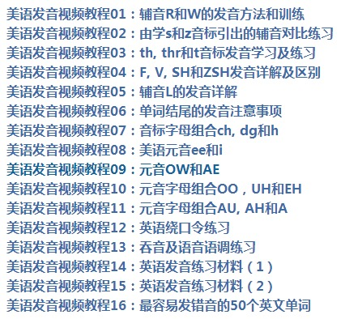

## MimicSelf 项目说明文档

[TOC]

### 01 项目介绍

`MimicSelf-基于STT、TTS、SDA的口型视频模仿发音矫正助手`是一款能够帮助使用者通过调整口型来矫正发音的小工具，在使用过程中，使用者可以使用两种不同的学习模式，利用程序所生成的口型视频来改善自身发音。

#### 1.1 成员介绍

* 李嘉杰

  2018-2019学年国家奖学金获得者 

  获得过以下奖项:

  2019中美青年创客大赛（上海赛区）冠军
  2019中美青年创客大赛总决赛 优胜奖
  2019同济大学数学建模竞赛 一等奖
  

负责工作：后端代码部分

* 李培昊

  负责工作：部分前端

* 刘雪迪

  负责工作：前端CSS部分

* 孙文麒

  2018-2019学年国家奖学金获得者 

  目前也正在进行校级创新创业项目的APP开发。

  获得过“纽劢杯”第十六届同济大学程序设计竞赛暨上海高校邀请赛 二等奖 

  负责工作：文档部分

* 负责工作：文档部分

* 王泽钜

  喜欢编程，热爱生活，乐于学习新鲜事物，喜欢和不同的人打交道，擅长团队合作和语言表达，享受创造的过程。 获得过以下奖项：
  
  同济大学大学生程序设计竞赛 二等奖
  
  中美青年创客大赛全国总决赛，取得了优胜奖
  
  同济大学数学建模竞赛 三等奖
  
  众安hackathon，成功入围AI赛道复赛 
  
  负责工作：网站后端（非算法部分）和部分网站前端以及项目设计

#### 1.2 项目背景

在雅思官方发布的“2019年全球雅思A类平均成绩TOP40排名”中，德国以总成绩7.43分的高分蝉联第一，希腊以总成绩6.97持续稳居第二。中国大陆以5.78分的总成绩排名第33位，同比2017年上升1位。亚洲国家中，英语为主流语言的马来西亚、菲律宾进入前十。此外，泰国、印度、越南、韩国、日本亚洲国家排名均优于中国大陆。

良好的发音对于语言的学习有着不可估量的作用.准确的发音不仅能够增强对语言信息的提取，提高学习者的听力能力，也能在学习过程中，使学习者更容易记忆单词、句式，培养语感等等。中国人在英语学习中投入了大量的时间精力，但收效却不甚理想，这是传统的口语学习方式的不科学导致的。我们在英语口语的教学过程中极大地低估了“口型”的重要性，我们有着大量的英语听力素材摄入量，但在“口型”学习上却严重不足。

在学习说一门语言的过程中，发音练习非常重要，而学好发音仅靠听觉输入是不足的。以英语为例，在发音训练上，看视频教程比跟读音频要好，因为视频教程往往更直观，更有利于掌握发音要点，比如/θ/的发音，连读等。

事实上，发音不准很大的原因是嘴型和舌头不到位，/f/和/v/音不摩擦下嘴唇，/r/音舌头不卷得不充分等。这时就需要大量的模仿纯正美语发音的口型，看发音视频课。 

比如由Paul S Gruber保罗.格罗博士录制的美式英语发音视频教程。 

 再如美国斯坦福大学语言学教授，加州大学圣地亚哥语言研究中心首席科学家Lisa博士的发音教程，将教你怎样使用舌头、嘴唇、牙齿，发出地道的美语口语发音。 

  

但是这样的视频教程仍然存在着进一步改善教学质量的空间。

1. 教学素材单一。
   视频形式的教学材料需要录制后发布，因此所有发音素材皆为固定素材。这意味着当学习者希望了解某一个特定单词或长句的标准发音以及对应的标准口型时，此类视频资料将无能为力。

2. 教学缺乏个性化。
   不同人种间，不同个体间肌肉成分、骨骼结构差距极大，不同的人在发出同一个标准音时的口型不可能完全一样，学习者如果盲目地模仿单一教学者的口型势必会影响学习效果。 
3.  学习形式不灵活。
   此类学习视频被制作成固定形式。每一次的发音学习与训练都必须从某一个视频的开头开始，而之前看过或已经掌握的发音练习部分将变为额外信息，成为学习者不必要时时间成本。相比之下，理想的学习模式应是让学习者可以将精力集中用于需要学习的几个音、词、句上进行练习。

而问题是，在发音矫正这方面，并没有APP给出了解决方案，目前意义上的APP都只是锻炼口语交际，并没有革新性的手段来帮助改正发音，大多数情况下，用户都只能采取观看视频学习口型这一手段。这种方法的效率并没有想象中的那么高，大多数情况下都无法奏效。

因此，我们团队决定从纠正发音这一方面出发，基于传统发音教学，提出新的方案，进一步提高效率。换言之，本项目想要解决的问题是“如何利用新技术，让口型发音矫正更高效”这一问题。

#### 1.3 当前痛点

1.  人数：学生英语课上难以清晰学到标准的发音口型 
2.  角度：学生不同角度难以全面看清老师发音口型动作和细节 
3.  面部区别：每个人不同的面部特征对口型的发力有不同的影响 

### 02 竞品分析

#### 2.1 战略定位

| 竞品       | 产品定位    | 收益流            | 用户定位         | 主要功能                 |
| ---------- | ----------- | ----------------- | ---------------- | :----------------------- |
| 英语流利说 | 口语练习APP | 收费课程/"定制学" | 学生,白领为主    | 材料配音式练习;智能打分  |
| 扇贝口语   | 口语练习APP | 收费课程          | 高校学生群体为主 | 跟读;复述式学习;智能打分 |
| 口语视频   | 视频教学    | 打赏              | 几乎全覆盖       | 教学                     |

#### 2.2 产品功能

| 竞品       | 基本功能                                                     | 亮点功能                                   |
| ---------- | ------------------------------------------------------------ | ------------------------------------------ |
| 英语流利说 | 1. 英语水平测试 2. 自动提醒 3. 课程订阅 4. 发音准确度评分 5. 配音材料 | 1. 发音准确度评分 2. 课程内容丰富     |
| 扇贝口语   | 1. 自动提醒 2. 课程订阅 3. 配音材料 4. 发音准确度评分 5. 联立其他扇贝功能 | 1. 发音准确度评分 2. 联立其他扇贝功能 |
| 口语视频   | 1. 发音教学 2. 多样化形式教学                           | 1. 形式多样化,吸引力强.                    |

#### 2.3 差异化分析

由于英语流利说和扇贝口语较为接近，此处以英语流利说为代表。

##### 2.3.1 英语流利说

通过将一些日常用语，影视对话，歌曲等作为朗读材料，提高用户口语.着重提高用户的整体口语能力，并且也提高用户的日常交际能力. 可以看出，英语流利说和扇贝口语两者的定位都是"口语练习"。两款APP都是以告诉用户哪里读的有问题，而不太涉及教学部分。

##### 2.3.2 视频教学

采取口型发音教学的手段，让用户去模仿视频中的标准发音，从而达到教学的作用。主要定位为发音矫正教学，但就如先前阐述项目背景中所提到的，事实上用户直接通过视频矫正发音的效率并不高，因此反馈（评论）也大多数较为中立。

### 03 创新性解决方案

1. 定制个性化的口型发音视频
2. AI场景下的趣味练习

在此基础上，用户也可以拍摄一段自己的口型，与生成的正确口型视频作对照，来更好地了解到自己口型的问题。

### 04 成果说明

#### 4.1 功能介绍

##### 模式一 录音学习模式

在这一学习模式下，用户可以通过自己朗读 单词/短句，来得到两段由程序生成的视频。第一段为直接根据用户发音而得出的原始口型，另一段为处理过后的标准口型视频。

自定义选项：

1. 可选择上传自己脸部照片生成口型或使用默认照片
2. 评分系统

特点：

1. 朗读与分析分离进行
2. 语音识别精确度高
3. 精确指出发音不标准之处，对症下药

##### 模式二 自由学习模式

在这一学习模式下，用户需要先输入一段文本，得到一段程序生成的标准口型视频。随后，用户可以在摄像头打开的同时，与标准口型视频同步朗读，视频与摄像头的图像会同时被呈现在屏幕上。

特点：

1. 同步朗读，实时比较
2. 灵活性强

### 05 Demo 使用说明

- 克隆本仓库 `git clone https://github.com/LeeJAJA/Microsoft_Speech_API.git`

- `cd Microsoft_Speech_API`
- `pip install -r requirements.txt`
- `cd Microsoft_Speech_API⁩/sda⁩/data && wget 'https://github.com/LeeJAJA/Microsoft_Speech_API/releases/download/1.0/crema.dat' && wget 'https://github.com/LeeJAJA/Microsoft_Speech_API/releases/download/1.0/grid.dat' && wget 'https://github.com/LeeJAJA/Microsoft_Speech_API/releases/download/1.0/timit.dat' && cd ../..` 
- `python run.py`
- 使用浏览器（推荐 Chrome）打开 Microsoft_Speech_API/index.html

### 06 使用语音 API 过程中的问题

1. 中国东部2区 Azure 无法正常使用语音 API 中 TTS 功能，导致在项目之初进展缓慢。
2. 东亚 Azure 语音 API 部分功能在12月1日出现 401 访问问题，暂时无法解决。